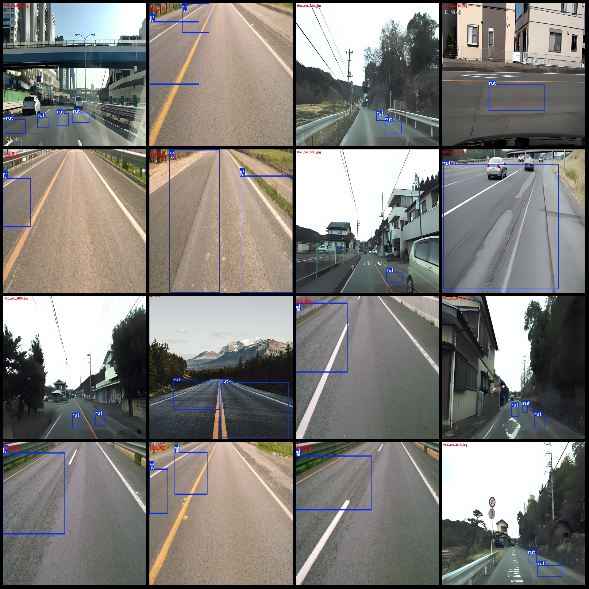
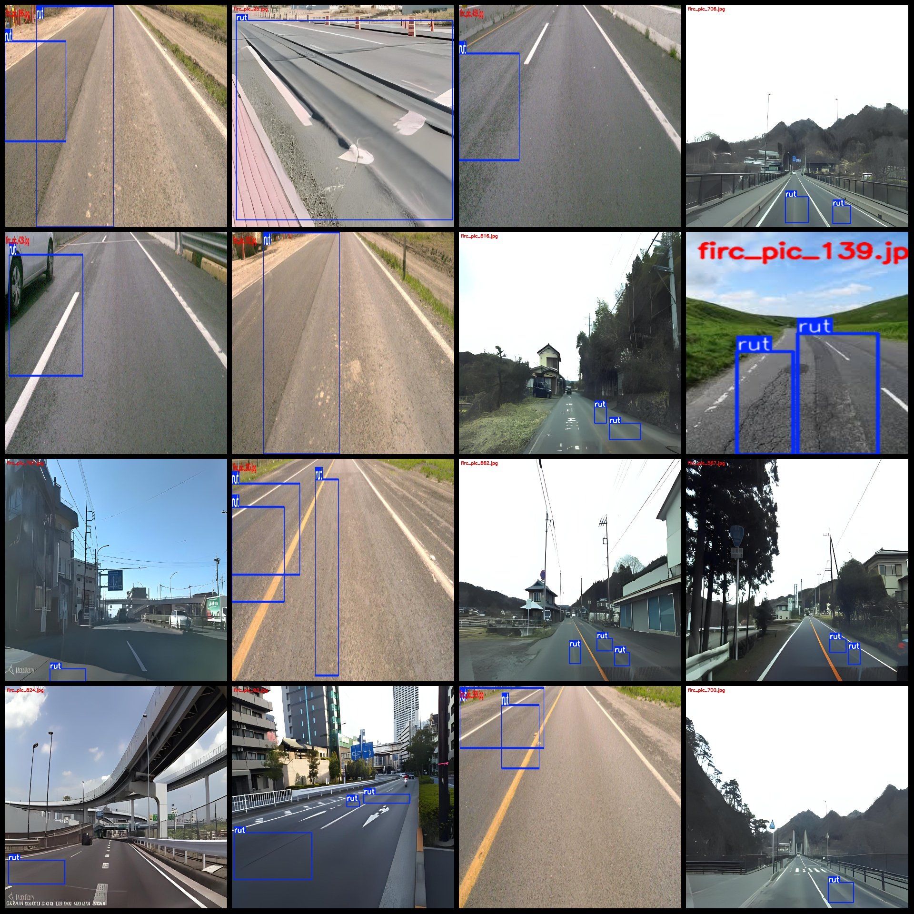

# Smart City Road Pavement Rut Detection Dataset (VOC+YOLO)

## Dataset Format:
- Format: Pascal VOC format + YOLO format (txt file without split paths, only containing jpg images and corresponding VOC format xml files and YOLO format txt files)
- Image count: 903
- Annotation count: 903
- Annotation count: 903
- Number of categories: 1
- Category name: ["rut"]
- Box number per category: 1469
- Total boxes: 1469
- Number of images per category: 903
- Image resolution: Multi-resolution images, e.g., 1200x1200, 1920x600, etc.
- Annotation tool: labelImg
- Annotation rules: Draw a rectangular box around the category
- Important note: The dataset does not have split training validation test sets; you need to partition them yourself.
- Special notice: This dataset does not guarantee the accuracy of the trained models or weight files.
- Preview of images:
- Example of annotation:

## Images

Here is a pay link on Stripe ( https://buy.stripe.com/3cs8yP7sY87d0vu9AB ). Please contact me lonlonago@foxmail.com after funding $89, and I will send you a complete data files , thank you!

